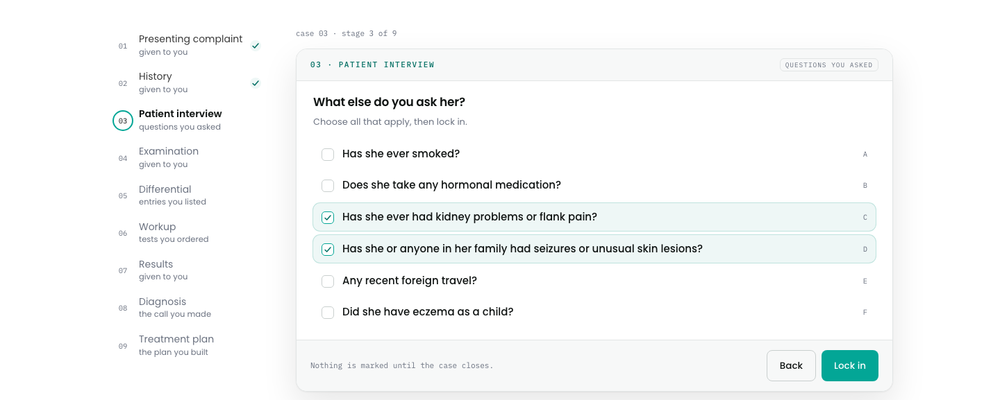
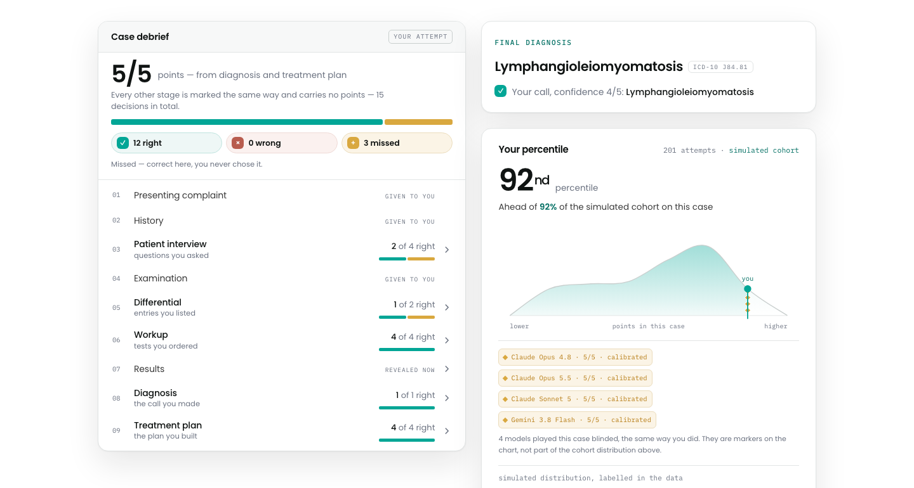
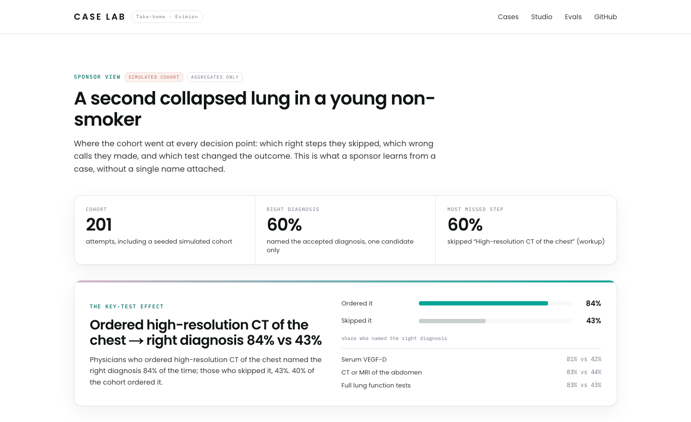
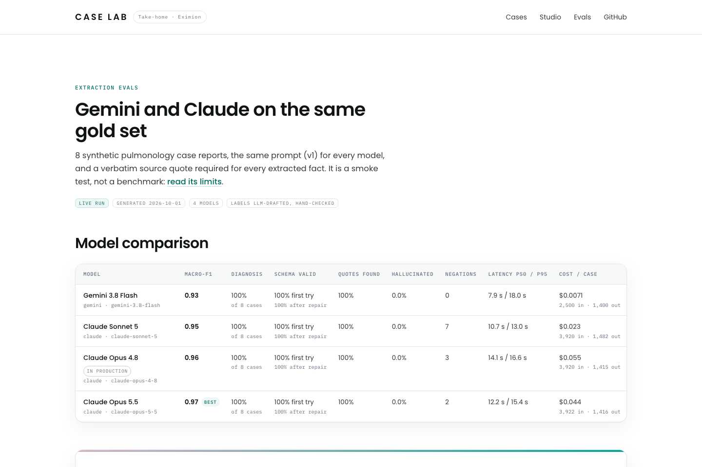

# Case Lab

**Clinical cases, end to end.** Paste a raw case report and an LLM (Gemini or Claude on Vertex AI) turns it into a structured case, quoting the source for every fact. The case is stored in a normalized PostgreSQL schema, a physician plays it in nine stages, and the server scores the attempt and returns a debrief and a percentile among peers. Correct answers never reach the browser before the case is closed.

Take-home assignment for Eximion · by [@ahrimmedia-beep](https://github.com/ahrimmedia-beep)

[](https://github.com/ahrimmedia-beep/clinical-case-lab/actions/workflows/ci.yml)

## Live

| | |
|---|---|
| Site | __WEB_URL__ |
| Case catalogue | __WEB_URL__/cases |
| Studio: raw text → playable case | __WEB_URL__/studio |
| Gemini vs Claude evals | __WEB_URL__/evals |
| API docs (OpenAPI) | __API_URL__/docs |

Outside the review window both services scale to zero, so the first request after a quiet period can take a few seconds.

<!-- SCREENSHOTS: put PNGs into docs/screenshots/ and replace this comment with a section like:
## Screenshots
| Player | Debrief with AI markers | Studio |
|---|---|---|
|  |  |  |
| **Review gate** | **Sponsor view** | **Evals** |
|  |  |  |
-->

## Try it in 2 minutes

1. **Play the hero case.** Open __WEB_URL__/cases and start the first case, lymphangioleiomyomatosis (LAM), a rare lung disease that is often missed for years. Ask questions and order tests (answers and results appear once you lock a stage in), name one diagnosis with a confidence, build a treatment plan and close the case. Nothing is marked until then.
2. **Read the debrief.** Points come only from the diagnosis and the treatment plan; every other decision is marked right, wrong or missed, with how often peers chose each option. The percentile curve places you in a labelled simulated cohort, with markers for the AI models that played the same case blinded. Try "LAM or pneumothorax" (a hedged diagnosis earns nothing) or tick every treatment (wrong picks cancel right ones, a harmful pick zeroes the plan).
3. **Open "Sponsor view →".** Pick rates per decision, the correct steps most often missed, the most common wrong diagnoses, and how much more often physicians who ordered the key test reached the right diagnosis.
4. **Build a case in the Studio.** On __WEB_URL__/studio pick a sample, extract with Gemini or Claude, and see every fact highlighted on its source quote, with grounding badges and the time and cost of the draft. "Publish as draft" stores it as an AI draft.
5. **Pass the review gate.** The review page shows the full answer key and five automated checks: quotes not found in the source, harmful options, diagnosis leaks, the answer pathway, leftover identifiers. Approve it and the case moves to the physician-reviewed shelf.
6. **Compare the models.** __WEB_URL__/evals shows field-level extraction accuracy, hallucination rate, latency and cost per case, with the caveats of a small synthetic gold set.
7. **Check the contract.** In __API_URL__/docs, `GET /api/cases/{slug}` returns a case without a single answer field.

## How each requirement is met

The assignment, translated from the original:

> **Backend (FastAPI + PostgreSQL).** A small FastAPI service: an endpoint accepts a clinical case as JSON and stores it in PostgreSQL with a normalized schema (Alembic migrations); an endpoint scores submitted answers.
>
> **Frontend (Next.js + TypeScript).** A Next.js (App Router) page that calls the backend: the case is rendered with Server Components, client-side interaction (submit a diagnosis, show the result), types shared between the API and the frontend.
>
> **LLM pipeline + GCP.** Build a structured case from raw clinical text according to a given JSON schema with an LLM (Vertex AI / Gemini or similar), with a mini-harness that measures extraction accuracy; package it in Docker and describe a Cloud Run deployment.

| # | Requirement | Implementation | Proof |
|---|---|---|---|
| B1 | FastAPI service | App factory with RFC 9457 problem+json errors: [backend/app/main.py](backend/app/main.py), routers in [backend/app/routers/](backend/app/routers/) | [API docs](__API_URL__/docs); [test_api_contract.py](backend/tests/test_api_contract.py) |
| B2 | An endpoint accepts a clinical case as JSON | `POST /api/cases` validates a `ClinicalCase` (stage rules, unique option keys, no diagnosis leak), caps the body at 256 KB and is idempotent by content hash: 201 for a new case, 200 for a repeat. [routers/cases.py](backend/app/routers/cases.py), [schemas/case.py](backend/app/schemas/case.py) | [test_api_cases.py](backend/tests/db/test_api_cases.py), [test_case_schema.py](backend/tests/test_case_schema.py); [seeds/load.py](backend/seeds/load.py) posts the showcase cases |
| B3 | Stores it in PostgreSQL with a normalized schema | Nine tables with foreign keys, unique keys and named checks, written in one transaction; the whole case is read back in one `jsonb_agg` query. [db/tables.py](backend/app/db/tables.py), [repository/cases.py](backend/app/repository/cases.py), [case_document.sql](backend/app/db/sql/case_document.sql) | ER diagram in [ARCHITECTURE.md](docs/ARCHITECTURE.md#data-model); [test_cases_repo.py](backend/tests/db/test_cases_repo.py) |
| B4 | Alembic migrations | [0001_initial.py](backend/alembic/versions/0001_initial.py), autogenerated from the Core tables and reviewed; CI runs `alembic upgrade head` and `alembic check` on PostgreSQL 18 | [test_migrations.py](backend/tests/db/test_migrations.py) (upgrade → downgrade → upgrade, no drift); `migrate` Cloud Run job before every api deploy |
| B5 | An endpoint that scores the answers | `POST /api/cases/{slug}/attempts`: pure [scoring.py](backend/app/scoring.py) with anti-gaming rules, then the debrief with percentile, histogram and pick rates from [repository/attempts.py](backend/app/repository/attempts.py) | [test_scoring.py](backend/tests/test_scoring.py) (select-all, harmful, hedged, spelling variants), [test_api_attempts.py](backend/tests/db/test_api_attempts.py) |
| F1 | A Next.js App Router page that calls the backend | The player page is an async Server Component, [cases/[slug]/page.tsx](web/src/app/cases/%5Bslug%5D/page.tsx), using the server-only typed client [lib/api/client.ts](web/src/lib/api/client.ts) | __WEB_URL__/cases; [client.test.ts](web/src/lib/api/client.test.ts) |
| F2 | Case rendered with Server Components | Each given stage is a Server Component ([given-stage.tsx](web/src/components/case/given-stage.tsx)) passed as a prop into the client stepper | View the page source of a case: the stages are in the server-rendered HTML |
| F3 | Client interaction: submit a diagnosis, show the result | Client stepper [case-player.tsx](web/src/components/player/case-player.tsx) and the Server Action `submitAttempt` in [app/actions.ts](web/src/app/actions.ts) → debrief and percentile cards | [actions.test.ts](web/src/app/actions.test.ts), [state.test.ts](web/src/components/player/state.test.ts) (stage lock, double-submit guard); a live play-through |
| F4 | Types shared between the API and the frontend | Pydantic → [openapi.json](backend/openapi.json) → `openapi-typescript` → [schema.d.ts](web/src/lib/api/schema.d.ts) → `openapi-fetch` client | `make check-gen` in CI fails on any drift |
| L1 | Raw clinical text → structured case per a given JSON schema via an LLM | [backend/pipeline/](backend/pipeline/): de-identify → extract against [extracted-facts.schema.json](schemas/extracted-facts.schema.json) with up to two repair rounds → locate every quote in the source → author the decisions → assemble a case valid against [clinical-case.schema.json](schemas/clinical-case.schema.json); served by `POST /api/extract` | [test_pipeline_extract.py](backend/tests/test_pipeline_extract.py), [test_pipeline_grounding.py](backend/tests/test_pipeline_grounding.py), [test_pipeline_api.py](backend/tests/test_pipeline_api.py) with a fake provider; __WEB_URL__/studio |
| L2 | Vertex AI / Gemini or similar | Gemini (`google-genai`) and Claude (`anthropic[vertex]`), both on Vertex AI, behind one protocol: [providers/](backend/pipeline/providers/) | [test_pipeline_providers.py](backend/tests/test_pipeline_providers.py); [check-models.sh](infra/check-models.sh) calls every model from Cloud Run |
| L3 | A mini-harness that measures extraction accuracy | [backend/evals/](backend/evals/): 8 synthetic gold cases, pure metrics, a resumable runner, Markdown and JSON reports | [test_evals_metrics.py](backend/tests/test_evals_metrics.py), metric floor in CI (`make eval-offline`); [EVALS.md](docs/EVALS.md); __WEB_URL__/evals |
| L4 | Packaged in Docker | [backend/Dockerfile](backend/Dockerfile), [web/Dockerfile](web/Dockerfile), [compose.yaml](compose.yaml) | `docker compose --profile app up --build` |
| L5 | Cloud Run deployment described | [DEPLOY.md](docs/DEPLOY.md) and [infra/deploy.sh](infra/deploy.sh), the idempotent script that was actually run | The live URLs above |

## Beyond the brief

- **AI players on the percentile curve.** Gemini and Claude models play each reviewed case blinded, seeing only what a physician sees, and are scored by the same code. They appear as labelled markers on the curve ("Claude Opus 4.8 · 4/6 · overconfident") and never count in the cohort.
- **AI draft → physician review gate.** Pipeline output is stored as a draft. A reviewer sees the answer key plus a server-computed checklist and approves; until then the case is labelled "AI draft · not physician-reviewed".
- **Sponsor insights per decision point.** Pick rates, missed key steps, top wrong diagnoses and the key-test effect for each case.

How each works: [ARCHITECTURE.md](docs/ARCHITECTURE.md#beyond-the-brief).

## Architecture

Two Cloud Run services and one database. **web** (Next.js 16) renders every page on the server and is the only caller of the API. **api** (FastAPI) owns ingest, scoring, the LLM pipeline, review and insights; it reaches Cloud SQL for PostgreSQL 18 through a unix socket and Gemini and Claude through Vertex AI with its service account. A `migrate` job runs Alembic before every api deploy. Pydantic models are the single source of truth for the API, the LLM output and the TypeScript types.

```
backend/   FastAPI app, Alembic, LLM pipeline, eval harness, seeds, tests
web/       Next.js 16 App Router: catalogue, player, debrief, studio, review, insights, evals
schemas/   exported JSON Schemas (the case contract)
infra/     deploy, teardown, database pause, model check, API-key fallback
docs/      architecture, deployment, evals
```

- [docs/ARCHITECTURE.md](docs/ARCHITECTURE.md): system diagram, ER diagram of the nine tables, how answers are kept out of the browser, scoring rules.
- [docs/DEPLOY.md](docs/DEPLOY.md): what the deploy script does, IAM, secrets, costs, rollback, production hardening, HIPAA.
- [docs/EVALS.md](docs/EVALS.md): gold set, metrics and how to read the numbers.

## Run it locally

Prerequisites: Docker, [uv](https://docs.astral.sh/uv/), Node 24 and pnpm 12.

Everything in containers:

```bash
docker compose --profile app up --build   # Postgres, migrations, API on http://localhost:8000/docs, web on http://localhost:3000
make seed                                 # three showcase cases through the API
make simulate                             # labelled simulated cohort, 200 attempts per case
```

For development:

```bash
make db && make migrate                    # PostgreSQL 18 on localhost:5434, schema at head
cd backend && uv sync && uv run fastapi dev app/main.py   # API on http://localhost:8000
cd web && pnpm install && pnpm dev         # http://localhost:3000; without API_BASE_URL the web serves built-in fixtures
API_BASE_URL=http://localhost:8000 pnpm dev   # the same, against the local API
```

The player, scoring, review and insights need no model access. The Studio and the AI players need Vertex AI credentials (`gcloud auth application-default login` and `GCP_PROJECT`) or `GEMINI_API_KEY` / `ANTHROPIC_API_KEY`; `PIPELINE_FAKE_LLM=1` swaps in deterministic fixtures. See `.env.example`.

## Tests and CI

```bash
make lint-backend test-backend eval-offline check-gen    # backend tests need the compose database (make db)
cd web && pnpm typecheck && pnpm exec eslint . && pnpm test
```

GitHub Actions ([ci.yml](.github/workflows/ci.yml)) runs three jobs on every push: **backend** (ruff, mypy strict, `alembic upgrade head` and `alembic check` on a PostgreSQL 18 service, pytest with database integration tests, the offline eval with its metric floor), **web** (typecheck, ESLint, Vitest, production build) and **contracts** (regenerated OpenAPI, JSON Schemas and TypeScript types must match the commit; no secrets, env files or non-English text; every repo path named in the docs exists).

TypeScript is pinned to 5.9.3 on purpose: openapi-typescript does not work with TypeScript 7 yet.

## Model comparison

Extraction accuracy on 8 synthetic pulmonology case reports with deliberate traps (negations, abbreviations, unit variants, a number written in words). Models: Gemini 3.8 Flash, Claude Sonnet 5, Claude Opus 4.8 and Claude Opus 5.5, all on Vertex AI.

<!-- The table between the markers is generated: python3 scripts/update_eval_tables.py copies the first table of backend/evals/reports/latest.md. -->
<!-- eval-table:start -->
_The live comparison table is added here after the eval run._
<!-- eval-table:end -->

Method, metrics and caveats: [docs/EVALS.md](docs/EVALS.md). Reproduce without keys: `make eval-offline` re-scores the committed recordings; `make eval` runs the models live.

## Decisions and trade-offs

| Decision | Why | Production alternative |
|---|---|---|
| Normalized PostgreSQL; SQLAlchemy Core for writes, hand-written SQL for reads | The reads are shaped, not CRUD: a whole case in one `jsonb_agg` query, `percent_rank()` percentiles, pick rates and insights as CTEs. Every query is visible and explainable as it runs; Alembic autogenerates from the Core tables and CI runs `alembic check` | Same split; precomputed cohort statistics once attempts grow large |
| Scoring only on the server; the public case model has no answer fields | Correctness must not be inferable from the page or the network tab. One scorer serves physicians, the simulated cohort and AI players | Same, plus accounts so attempts are attributable, and rate limits on attempts |
| Pydantic → OpenAPI → TypeScript types | One hand-written contract; a renamed field breaks `tsc`; CI fails on drift | Same; a published client package if more consumers appear |
| Gemini and Claude behind one small protocol on the official SDKs, no LiteLLM | The task names Vertex AI / Gemini and Claude is what the team runs, so comparing them on the same task is the useful result. Provider details (structured-output limits, refusals, effort) leak through gateways anyway, and LiteLLM's PyPI releases 1.82.7–1.82.8 were compromised in March 2026 | Same pattern; a gateway only with many providers |
| Own verbatim grounding instead of Claude citations | Claude's citations cannot be combined with structured outputs and Gemini has no equivalent. One deterministic check covers both providers and feeds the hallucination metric | Same, plus a reviewer action to accept near-miss quotes |
| Simulated cohort, labelled as simulated | A percentile and sponsor insights need a cohort on day one. The policy is causal (ordering the key test raises the chance of the right diagnosis), so the insights show a real effect; AI players are kept out of it | Real physician attempts; no percentile below a minimum cohort |
| AI drafts stay drafts until a physician approves | "AI-assisted, not AI-generated": the reviewer checks a list of flagged items computed on the server, not the whole case again | Two independent reviewers, reviewer identity, an audit trail and comments per item |
| Public API with internal-key guards | Reviewers can open the API docs. `/api/extract`, review, approve, insights and AI attempts need `X-Internal-Key`, held only by the web server; CORS allows only the web origin; input caps, per-IP and daily limits; at most 3 instances as a cost breaker | Private API (`--no-allow-unauthenticated`) with ID tokens from the web service account; Cloud Armor |
| In-memory rate limiter and extraction cache, per instance | No extra infrastructure for at most 3 instances | Cloud Armor rate rules; a shared cache |
| Database password in Secret Manager, Cloud SQL unix socket | Simplest secure path for a demo: generated once, never regenerated by a re-run, readable only by the api service account | IAM database authentication with the Cloud SQL Python Connector, private IP |
| Images built by Cloud Build from an idempotent script | One command, safe to re-run after an interruption, no ARM/AMD64 mismatch from a laptop | Terraform plus a GitHub Actions deploy through Workload Identity Federation that ships the CI-tested image |
| Regex de-identification with a pre-send guard | Keeps synthetic demo text clean and refuses to send anything that still looks like an identifier | Cloud DLP or a clinical de-identifier, inside a BAA-covered configuration |

## What I would do next

- **Accounts and attributable attempts:** physician sign-in, real cohorts in place of the simulated one, percentiles by specialty and seniority.
- **A complete review workflow:** two independent faculty reviewers, comments per item, agreement tracking and an audit trail, as accreditation requires.
- **Evals that grow with the product:** a larger physician-labelled gold set, an LLM judge for the authored vignette and explanations calibrated against reviewer labels, an eval gate in CI for prompt and model changes, and the eval as a scheduled Cloud Run job.
- **AI players as a benchmark:** run every new model on every approved case and track decisions and calibration over time, not only the final answer.
- **Production posture:** private API with ID tokens, IAM database authentication, private IP, Terraform and a keyless deploy pipeline ([DEPLOY.md](docs/DEPLOY.md#production-hardening)).
- **Clinical-grade de-identification** and a BAA-covered configuration before any real patient data.
- **An end-to-end browser test** in CI that plays a seeded case, plus uptime checks.

## Data handling

Every case in this repository is synthetic. Text is de-identified before any model call, and a guard refuses to send text that still contains identifiers. Logs carry ids, model names, token counts, cost and timings, never the clinical text, the extracted facts or the answers. Answers stay on the server until a case is closed. See the HIPAA note in [DEPLOY.md](docs/DEPLOY.md#hipaa).

## How this was built

I used Claude Code throughout: to research the stack, to turn my decisions into a design spec and implementation plans, and to implement them with parallel agents, test-first, with tests and CI as the gate for every task. I set the architecture and the product decisions, reviewed the work, and I am accountable for all of it.
