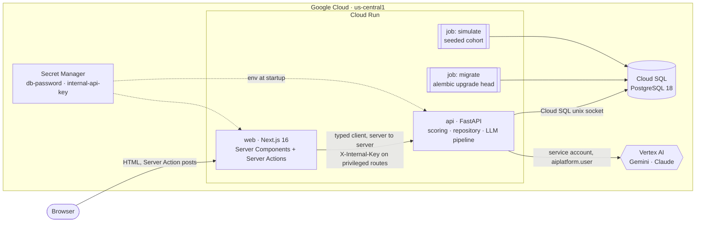
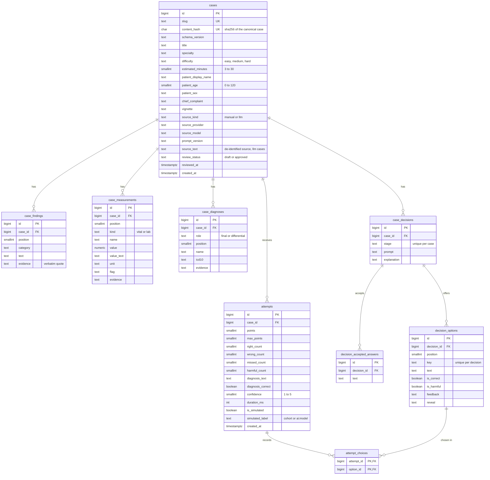

# Architecture

Case Lab joins the three parts of the assignment into one flow: raw clinical text → LLM extraction with a verbatim quote behind every fact → a normalized PostgreSQL case → a physician plays it in nine stages → the server scores it and returns a debrief and a percentile.

## System

- **web** renders every page on the server. Server Components fetch from the API, Server Actions submit attempts, reveals and Studio requests. The API client (`web/src/lib/api/client.ts`) is a `server-only` module, so the browser never calls the API and never sees the internal key.
- **api** owns the data, the scoring and the LLM pipeline. It reaches Cloud SQL through Cloud Run's built-in Cloud SQL connection (a unix socket) and Vertex AI with its own service account, so no API keys are needed in production.
- **migrate** runs `alembic upgrade head` with the api image and is awaited before every api deploy. **simulate** writes the labelled simulated cohort. Details: [DEPLOY.md](DEPLOY.md).

| Path | Responsibility |
|---|---|
| `backend/app/schemas/` | Pydantic contracts: the single source for the API, the LLM output models and the web types |
| `backend/app/routers/` | HTTP layer, RFC 9457 `application/problem+json` errors |
| `backend/app/db/tables.py` | SQLAlchemy Core tables, the source for Alembic autogenerate |
| `backend/app/db/sql/` | hand-written read and analytics SQL |
| `backend/app/repository/` | idempotent ingest, case document, attempts, review, insights |
| `backend/app/case_views.py` | the only projection from a stored case to what the player may see |
| `backend/app/scoring.py` | pure scoring and diagnosis matching |
| `backend/pipeline/` | providers, de-identification, extraction, grounding, authoring, AI player |
| `backend/evals/` | gold set, metrics, resumable runner, report |
| `backend/seeds/` | showcase cases, simulated cohort, AI-player runner |
| `web/src/app/` | routes and Server Actions |
| `web/src/lib/api/` | generated types and the server-only typed client |
| `infra/` | deploy, teardown, database pause, model check, API-key fallback |

## Data model

Nine tables, generated from `backend/app/db/tables.py` by `backend/alembic/versions/0001_initial.py`; CI runs `alembic upgrade head` and `alembic check` so the two cannot drift.

Constraints worth knowing: named checks on every enum-like column, on age, minutes and confidence; a partial unique index allows one `final` diagnosis per case; `(case_id, stage)` is unique on decisions and `(decision_id, key)` on options; a check forbids an option that is both correct and harmful; `(case_id, points)` is indexed for the percentile and histogram, `attempt_choices(option_id)` for pick rates. Every foreign key cascades on delete.

Writes are SQLAlchemy Core inserts in one transaction. Ingest is idempotent: `content_hash` covers the canonical case without its `source`, and `INSERT … ON CONFLICT (content_hash) DO UPDATE … RETURNING (xmax = 0) AS inserted` tells a new case from a repeat in one round trip (201 vs 200). Reads are SQL files in `backend/app/db/sql/`: the whole case is one query built with `jsonb_build_object` and `jsonb_agg` (no N+1), the percentile uses `percent_rank()`, pick rates, histogram and sponsor insights are CTEs.

## Contracts

1. Pydantic models in `backend/app/schemas/` are the only hand-written contract.
2. `make gen` exports `backend/openapi.json` (from the app, no database needed) and the JSON Schemas in `schemas/`, then `openapi-typescript` writes `web/src/lib/api/schema.d.ts`.
3. The web's `openapi-fetch` client is typed by it, so a renamed field breaks `tsc`.
4. CI regenerates everything and fails on any diff (`make check-gen`).

The models the LLMs fill in (`backend/pipeline/models.py`) are a stricter variant that fits Claude's structured-output limits; they are converted into the same `ClinicalCase` the ingest endpoint validates.

## Answers never reach the browser

The browser sees answers only in the debrief, after the attempt is stored. Before that:

- **No field to leak.** `CasePublic` has no field for correctness, harm, feedback, explanations, accepted answers, the final diagnosis, the differential, reveals or the source text. `backend/tests/test_case_schema.py` checks the JSON Schema's property names; `backend/tests/test_case_views.py` checks the serialized public case.
- **One projection.** `build_case_public` in `backend/app/case_views.py` is the only path from a stored case to the player. Any given-stage finding or measurement that names the diagnosis or an accepted answer becomes "Result withheld until the debrief".
- **Reveals only on request.** `POST /api/cases/{slug}/reveal` returns the patient's answer or test result for the options the player chose, without correctness, through the same redaction.
- **Scoring on the server.** `POST /api/cases/{slug}/attempts` loads the answer key, scores, and stores the attempt and its choices in one transaction (`backend/app/repository/attempts.py`).
- **Privileged routes need the key.** The answer key for reviewers (`/review`), sponsor insights and AI attempts require `X-Internal-Key`, which only the web server holds. The insights page also requires the httpOnly cookie `closed_<slug>` that the submit action sets.
- **Authoring refuses leaks.** The ingest validator rejects a case whose title, vignette, chief complaint, decision prompts or interview and workup reveals name the diagnosis, and the LLM author is re-asked once when it leaks.

## Scoring

Pure functions in `backend/app/scoring.py`, used by human attempts, the simulated cohort and the AI players alike. They follow the debrief on Eximion's public site: nothing is marked until the case closes, points come only from the diagnosis and the treatment plan.

- **Multi-select stages** (interview, differential, workup, treatment): right = chosen ∩ correct, wrong = chosen − correct, missed = correct − chosen; harmful picks are reported in every stage. Only treatment earns points.
- **Diagnosis:** free text, normalized (case, accents, punctuation, dotted initials, an abbreviation map such as PE, LAM, AATD). Right if it equals an accepted answer, is within `token_sort_ratio ≥ 90` of one (severity words such as "acute" ignored), or names one as a whole phrase with extra qualifiers ("Sporadic LAM with recurrent pneumothorax and renal angiomyolipoma", "AATD-related panlobular emphysema", "Acute PE secondary to DVT"). A negated mention ("not PE") does not count, and a less specific answer ("Pneumothorax" for "Tension pneumothorax") stays wrong.
- **Points:** diagnosis right = 1; treatment = `max(0, right − wrong)`; `max_points = 1 + correct treatment options`.
- **Anti-gaming:** any harmful treatment option zeroes the treatment points, so ticking every box scores 0. A diagnosis that names several candidates is wrong and flagged `hedged`: any explicit marker ("PE or pneumonia", "LAM / pneumothorax", "PE vs. pneumonia", "PE; pneumonia", "PE?"), or a comma / "and" list whose items name different diagnoses from the case's vocabulary (accepted answers, final diagnosis, differential, differential options), such as "PE, pneumothorax". A comma followed by qualifiers ("Sarcoidosis, Scadding stage II", "Acute PE, secondary to DVT") is not a list.
- **Calibration:** confidence 4–5 and wrong is overconfident, 1–2 and right is underconfident.
- **Percentile:** `percent_rank()` over `(points, right_count)` among the case's human and simulated-cohort attempts, shown from 5 attempts on. AI-player attempts (`simulated_label LIKE 'ai:%'`) are excluded from the cohort, the histogram and pick rates.

Tests: `backend/tests/test_scoring.py` (including select-all, harmful and hedged cases) and `backend/tests/db/test_api_attempts.py`.

## Beyond the brief

**AI players on the percentile curve.** `backend/pipeline/ai_player.py` plays a stored case blinded: it receives only `CasePublic`, asks for reveals of the options it chose, and commits to one diagnosis, a confidence and a treatment plan in two structured-output turns. The attempt goes through the same scorer and is stored as `ai:<model>`. The debrief draws each model as a labelled marker on the curve, outside the cohort. Run: `make ai-players` after seeding (`backend/seeds/ai_players.py`).

**AI draft → physician review gate.** Cases built by the pipeline are stored as `draft`, with their de-identified source text. `GET /api/cases/{slug}/review` returns the full answer key and a checklist computed without an LLM: quotes not found in the source, harmful options to sign off, diagnosis leaks, the answer pathway, and leftover identifiers. `POST /api/cases/{slug}/approve` moves the case to `approved`. Code: `backend/app/repository/review.py`.

**Sponsor insights per decision point.** `GET /api/cases/{slug}/insights` (one query, `backend/app/db/sql/insights.sql`) returns pick rates per option, how often each correct step was missed, the most common wrong diagnoses, and the key-test effect: diagnostic accuracy for physicians who ordered each correct workup test versus those who did not. The simulated cohort is causal (0.8 vs 0.3 chance of the right diagnosis), so the effect is visible and labelled as simulated.

**Showcase content.** The LAM case (lymphangioleiomyomatosis, a rare disease often missed for years) leads the catalogue, next to AATD and pulmonary embolism (`backend/seeds/cases/`).

## Limits

- `/api/extract`: `X-Internal-Key`, at most 20 000 characters, 5 model runs per minute per client IP and 200 per day (in memory, per instance), results cached by text, provider, model and prompt version.
- Case ingest is capped at 256 KB.
- The async pool (5 + 2 overflow) times at most 3 api instances stays under the 25 connections of `db-f1-micro`.
- Pipeline and AI-player logs carry provider, model, tokens, cost, latency and counts, never the text, the facts or the answers.
